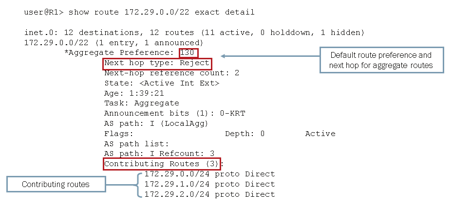

# Protocol Independent Routing

## Exam Objectives

- Identify the concepts, operation or functionality of various protocol-independent routing components
  * Static, aggregate, and generated routes
  * Martian addresses
  * Routing instances, including RIB groups
  * Load balancing
  * Filter-based forwarding
- Demonstrate knowledge how to configure, monitor, or troubleshoot various protocol-independent routing components
  * Static, aggregate, and generated routes
  * Load balancing
  * Filter-based forwarding

## Theory 

### Static, Aggregate, and Generated Routes

- Static Routes (SRs)
  * Static routes are manually configured routes configured in the `routing-options` stanza.
  * SRs can provide stability in routing advertisements when injected into routing protocols, particularly when injected routes are from networks with often changing routes.
  * All SRs must have a valid `next-hop` defined and, by default, the next-hop must be reachable via a direct route.
  * SRs have a global preference of **5**.
  * SRs become active whenever there is a viable next-hop.
  * Default values for static routes can be changed under the `defaults` stanza.
- Aggregate Routes (ARs)
  * Aggregate routes are manually configured routes that combine groups of routes into a single routing entry.
  * ARs are used for sending out advertisements for groups of routes, *not for forwarding*, and thus cannot be routed to.
    + Because ARs cannot be forwarded to, the next-hop of an AR will always be `discard` or `reject`.
  * ARs are represent by super-nets/aggregate network prefixes.
    + e.g., 192.168.0.0/24, 192.168.1.0/24, 192.168.2.0/24 and 192.168.3.0/24 can be represented as 192.168.0.0/22.
  * ARs need a contributing route to become active.
    + *Contributing routes* are more specific routes that are learned either by static entry or via a routing protocol.
    + Contributing routes can only contribute to a single aggregate route.
  * ARs can contribute to less specifc aggregate routes
    + 192.168.0.0/22 can contribute to 192.168.0.0/16
  * ARs have global preference of **130**.
- Generated Routes (GRs)
  * Generated routes are a type of aggregate route that is manually configured to advertise a next-hop for a group of routes and used for forwarding (unlike most ARs).
  * GRs are also called 'routes of last resort' because typically traffic is routed to more specific routes; GRs, however, are broad, generalized non-specific routes that generate their next-hops from a preferred contributing route.
  * GRs become active when a contributing route is learned
  * The next-hop of a GR is derived from the preferred contributor, which is the route within the aggregate range of prefixes that has the lowest route preference.
    + In the event routes have the same preference, the route with the lowest prefix (not prefix length) with be the preferred contributor.
      * e.g., If 10.100.0.0/16 and 10.101.0.0/16 were both learned from OSPF, the next-hop for 10.100.0.0/16 would be used for the GR.
  * Direct or local connections cannot contribute to a GR because they do not have next-hop.
  * GRs can be distinguished from ARs in `show route <route> exact detail` by the existence of a next-hop; ARs will have a `discard` or `reject`.
  * Because GRs are ARs, they have global preference of **130**.
- Next-Hop
  * There are three types of next-hops:
    + `discard` - Drop the packet and don't send ICMP message back; i.e., silently discard.
    + `reject` - Drop the packet and send an ICMP destination unreachable (ICMP Type 3 packet). This is not a specific command, but the default behavior of a next-hop. 
    + *Forwarding* - Send the packet to a downstream node.
      * Point-to-point links can use interface names as next-hops.
      * LAN interface types must have an IP as the next-hop. 
  * Next-Hop Forwarding has three types of qualifiers:
    + `resolve` - Because Junos does not perform recursive lookups for forwarding addresses by default, `resolve` must be used on the next-hop if the next-hop address is not directly connected.
    + `qualified-next-hop` - Known as a *floating static route* with other vendors, `qualified-next-hop` is a method of configuring an alternative next-hop in a static route should the primary route become unavailable. `qualified-next-hop` uses preference values to indicate when a route should be used as an alternative.
- Additional Static/Aggregate/Generated Route Options
  * Many static route options exist and can be seen by using `?` in a `set` statement such as `set routing-options static route 0/0 ?`.
  * Some particular options of note in the study guide:
    + `as-path` - Value used if the route is intended to be redistributed in BGP
    + `community` - Another BGP value. Adds community values to the route.
    + `metric` - When multiple routes have the same preference value, metric is a value used to prefer one route over the other.
    + `preference` - Used to set different preference values if desired (such as with `qualified-next-hop`).
    + `no-readvertise` - Used to state that the route should not be advertised in routing protocols. Suggested to be used in routes for management traffic. 
  * For aggregate/generated routes, `policy` is an option that is used for route filters or specific conditional statements.
- Example Configurations
  * Static Routes
    ```
    [edit routing-options]
    user@R1# show
        defaults {
            # Sets default preference for all static routes
            preference 250;
        }
        static {
            # Default route is 172.30.25.1, but 172.30.25.5 should 172.30.25.1 go down.
            route 0.0.0.0/0 {
                next-hop 172.30.25.1;
                qualified-next-hop 172.30.25.5 {
                    preference 251;
                }
            }
            # This route will inherit a preference value of 250. 
            route 172.28.102.0/24 {
                next-hop 10.210.11.190;
                no-readvertise;
            }
        }
    ```
  * Aggregate Routes
    + Show Aggregate Route Configuration
    + Show Aggregate Routes
      
      
  * Generated Routes
    ```
    [edit routing-options]
    user@R1# show
    generate {
        defaults {
            preference 130;
        }
        # When this is configured, the router will look for any non-local/non-direct route within this generated route (in this case, every route because it's 0/0), and will generate a next-hop from the route with the lowest preference value, and in the event of preference value tie, the lowest route prefix (or route with lowest IP address). 
        route 0.0.0.0/0;
    }
    ```